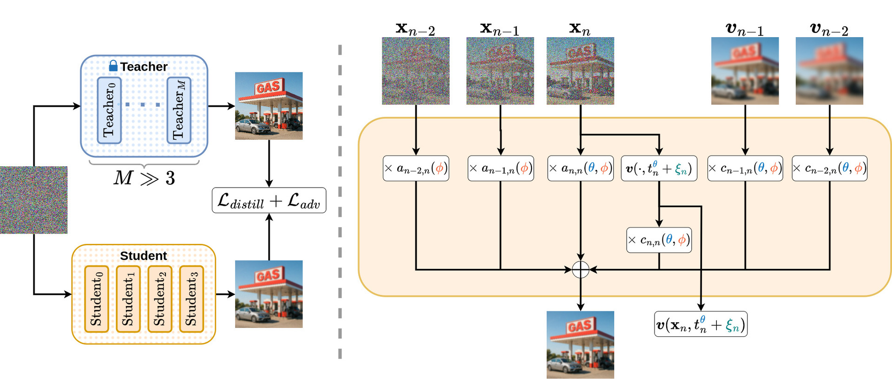

# GAS: Improving Discretization of Diffusion ODEs via Generalized Adversarial Solver
[](https://arxiv.org/abs/2510.17699)




<br>**GAS: Improving Discretization of Diffusion ODEs via Generalized Adversarial Solver**<br>
Aleksandr Oganov, [Ilya Bykov](https://github.com/philurame), [Eva Neudachina](https://github.com/neudachina), [Mishan Aliev](https://github.com/thecrazymage), Alexander Tolmachev, Alexander Sidorov, Aleksandr Zuev, Andrey Okhotin, [Denis Rakitin](https://github.com/RakitinDen), Aibek Alanov
<br>https://arxiv.org/abs/2510.17699<br>

Abstract: *While diffusion models achieve state-of-the-art generation quality, they still suffer from computationally expensive sampling. Recent works address this issue with gradient-based optimization methods that distill a few-step ODE diffusion solver from the full sampling process, reducing the number of function evaluations from dozens to just a few. However, these approaches often rely on intricate training techniques and do not explicitly focus on preserving fine-grained details. In this paper, we introduce the **Generalized Solver (GS)**: a simple parameterization of the ODE sampler that does not require additional training tricks and improves quality over existing approaches. We further combine the original distillation loss with adversarial training, which mitigates artifacts and enhances detail fidelity. We call the resulting method the **Generalized Adversarial Solver (GAS)** and demonstrate its superior performance compared to existing solver training methods under similar resource constraints.*

## Table of Contents
- [Setup Environment](#setup-environment)
- [Download Pretrained Models and FID Reference Sets](#download-pretrained-models-and-fid-reference-sets)
- [Generating Teachers Data](#generating-teachers-data)
- [Calculating FID](#calculating-fid)
- [Training GAS](#training-gas)
- [Inference with trained GS](#inference-with-trained-gs)
- [Datasets](#datasets)
- [Pre-trained models](#pre-trained-models)
- [Citation](#citation)

---

## Setup Environment

See [requirements.yml](requirements.yml) for exact library dependencies. You can use the following commands with Miniconda3 to create and activate your Python environment:

```.bash
conda env create -f requirements.yml -n gas
conda activate gas
```


## Download Pretrained Models and FID Reference Sets

All necessary data will be automatically downloaded by the script. Note that this process may take some time. If you wish to skip certain downloads, you can comment out the corresponding lines in the script.

```.bash
bash scripts/downloads.sh
```

## Generating Teachers Data 

Before training **GS/GAS**, we first need to generate teacher data. To get a batch of images using a teacher solver, run:

```.bash
# Generate 64 images and save them as out/*.png
python generate.py --config=configs/edm/cifar10.yaml \
	--outdir=out \
	--seeds=00000-63 \
	--batch=64
```

Generating a large number of images can be time-consuming; the workload can be distributed across multiple GPUs by launching the above command using `torchrun`:

```.bash
# Generate 50000 images using 2 GPUs
torchrun --standalone --nproc_per_node=2 generate.py \
	--config=configs/edm/cifar10.yaml \
	--outdir=data/teachers/cifar10 \
	--seeds=00000-49999 \
	--batch=1024
```
You can use option `--create_dataset=True` for create subdirs with dataset's chunks. The script `teachers.sh` handles this process. If you wish to skip certain datasets, you can comment out the corresponding lines in the script.

```.bash
bash scripts/teachers.sh
```

**We recommend using different seeds to generate teachers data and to evaluate student quality. For teachers, we use seeds 0-49999 for all datasets except MS-COCO, where we set the seeds to 0-29999.**

## Calculating FID

To compute Fréchet inception distance (FID) for a given solver, first generate the required number of random images and then compare them against the dataset reference statistics using `fid.py`:


```.bash
torchrun --standalone --nproc_per_node=1 fid.py calc \
	--images=data/teachers/cifar10 \
	--ref=fid-refs/edm/cifar10-32x32.npz
```

It is common to use 50k images to calculate FID in most setups, whereas the MS-COCO dataset is usually evaluated on 30k images. 

The command can be parallelized across multiple GPUs by adjusting `--nproc_per_node`. The `fid.py calc` typically takes 1-3 minutes in practice. See python `fid.py --help` for the full list of options.

### Teachers FID

For instance, run `scripts/teachers_fid.sh` to compute FID scores across all teacher solvers.

```.bash
bash scripts/teachers_fid.sh
```

## Training GAS

After generating the teacher data, you can train **GS/GAS** using `main.py`. Below is an example of training **GS** on **CIFAR-10** with four sampling steps:

```.bash
python main.py --config=configs/edm/cifar10.yaml \
	--loss_type=GS --student_step=4
```

Below is an example of training **GAS** in the same setup:

```.bash
python main.py --config=configs/edm/cifar10.yaml \
	--loss_type=GAS --student_step=4
```

The training settings can be controlled through command-line options; see `python main.py --help` for more information. 
For training **GAS**, we recommend using the `--train_size=5000` for all datasets except CIFAR10.

```
# FFHQ
python main.py --config=configs/edm/ffhq.yaml \
	--loss_type=GAS --student_step=4 --train_size=5000

# AFHQv2
python main.py --config=configs/ldm/afhqv2.yaml \
	--loss_type=GAS --student_step=4 --train_size=5000

# LSUN
python main.py --config=configs/ldm/lsun_beds256.yaml \
	--loss_type=GAS --student_step=4 --train_size=5000

# ImageNet
python main.py --config=configs/ldm/cin256-v2.yaml \
	--loss_type=GAS --student_step=4 --train_size=5000

# MS-COCO
python main.py --config=configs/sd/coco.yaml \
	--loss_type=GAS --student_step=4 --train_size=5000
```


## Inference with trained GS

If you set the option `--checkpoint_path=path`, images are generated from the **GS** checkpoint; otherwise, they are generated from the teacher solver. See `python generate.py --help` for more information. Below is an example of generating images from a trained **GS** checkpoint on **CIFAR-10** with four sampling steps:

```.bash
# Generate 50000 images using 2 GPUs and a checkpoint from checkpoint_path
torchrun --standalone --nproc_per_node=2 generate.py \
	--config=configs/edm/cifar10.yaml \
	--outdir=data/teachers/cifar10 \
	--seeds=50000-99999 \
	--batch=1024 \
	--steps=4 \
	--checkpoint_path=checkpoint_path
```

**For a fair comparison and to avoid leakage of test seeds into the training dataset, we recommend using seeds 50000-99999 for all datasets except MS-COCO, which should use seeds 30000-59999.**

## Datasets

The teacher data is available at [Hugging Face Hub](https://huggingface.co/datasets/bayes-group-diffusion/GAS-teachers). We provide SD datasets with both 30,000 and 6,000 samples specifying the teacher NFE.  A list of datasets and related links are provided below:

| Dataset | Hugging Face Hub 
| :-- | :-- 
| CIFAR-10 | [50k samples link](https://huggingface.co/datasets/bayes-group-diffusion/GAS-teachers/blob/main/edm/cifar10/dataset.pkl)
| FFHQ | [50k samples link](https://huggingface.co/datasets/bayes-group-diffusion/GAS-teachers/blob/main/edm/ffhq/dataset.pkl)
| AFHQv2 | [50k samples link](https://huggingface.co/datasets/bayes-group-diffusion/GAS-teachers/blob/main/edm/afhqv2/dataset.pkl)
| LSUN-Bedrooms | [50k samples link](https://huggingface.co/datasets/bayes-group-diffusion/GAS-teachers/blob/main/ldm/lsun_beds256/dataset.pkl)
| ImageNet | [50k samples link](https://huggingface.co/datasets/bayes-group-diffusion/GAS-teachers/blob/main/ldm/cin256-v2/dataset.pkl)
| Stable diffusion | NFE=5: [6k samples link](https://huggingface.co/datasets/bayes-group-diffusion/GAS-teachers/blob/main/sd-v1/nfe=5/dataset_6k.pkl), [30k samples link](https://huggingface.co/datasets/bayes-group-diffusion/GAS-teachers/blob/main/sd-v1/nfe=5/dataset_30k.pkl); <br> NFE=6: [6k samples link](https://huggingface.co/datasets/bayes-group-diffusion/GAS-teachers/blob/main/sd-v1/nfe=6/dataset_6k.pkl), [30k samples link](https://huggingface.co/datasets/bayes-group-diffusion/GAS-teachers/blob/main/sd-v1/nfe=6/dataset_30k.pkl); <br> NFE=7: [6k samples link](https://huggingface.co/datasets/bayes-group-diffusion/GAS-teachers/blob/main/sd-v1/nfe=7/dataset_6k.pkl), [30k samples link](https://huggingface.co/datasets/bayes-group-diffusion/GAS-teachers/blob/main/sd-v1/nfe=7/dataset_30k.pkl); <br> NFE=8: [6k samples link](https://huggingface.co/datasets/bayes-group-diffusion/GAS-teachers/blob/main/sd-v1/nfe=8/dataset_6k.pkl), [30k samples link](https://huggingface.co/datasets/bayes-group-diffusion/GAS-teachers/blob/main/sd-v1/nfe=8/dataset_30k.pkl); 


## Pre-trained models

Pre-trained **GS** and **GAS** checkpoints are available at [Hugging Face Hub](https://huggingface.co/bayes-group-diffusion/GAS-students). A list of datasets and related links are provided below:

| Dataset | Hugging Face Hub 
| :-- | :-- 
| CIFAR-10 | [link](https://huggingface.co/bayes-group-diffusion/GAS-students/tree/main/edm/cifar10) 
| FFHQ | [link](https://huggingface.co/bayes-group-diffusion/GAS-students/tree/main/edm/ffhq)
| AFHQv2 | [link](https://huggingface.co/bayes-group-diffusion/GAS-students/tree/main/edm/afhqv2)
| LSUN-Bedrooms | [link](https://huggingface.co/bayes-group-diffusion/GAS-students/tree/main/ldm/lsun_beds256)
| ImageNet | [link](https://huggingface.co/bayes-group-diffusion/GAS-students/tree/main/ldm/cin256-v2)
| Stable diffusion | [link](https://huggingface.co/bayes-group-diffusion/GAS-students/tree/main/sd-v1)

## Citation

```bibtex
@misc{oganov2025gasimprovingdiscretizationdiffusion,
      title={GAS: Improving Discretization of Diffusion ODEs via Generalized Adversarial Solver}, 
      author={Aleksandr Oganov and Ilya Bykov and Eva Neudachina and Mishan Aliev and Alexander Tolmachev and Alexander Sidorov and Aleksandr Zuev and Andrey Okhotin and Denis Rakitin and Aibek Alanov},
      year={2025},
      eprint={2510.17699},
      archivePrefix={arXiv},
      primaryClass={cs.CV},
      url={https://arxiv.org/abs/2510.17699}, 
}
```

## Collaboration

If you are interested in collaborating, please reach out to us via [3145tttt@gmail.com](mailto:3145tttt@gmail.com).
